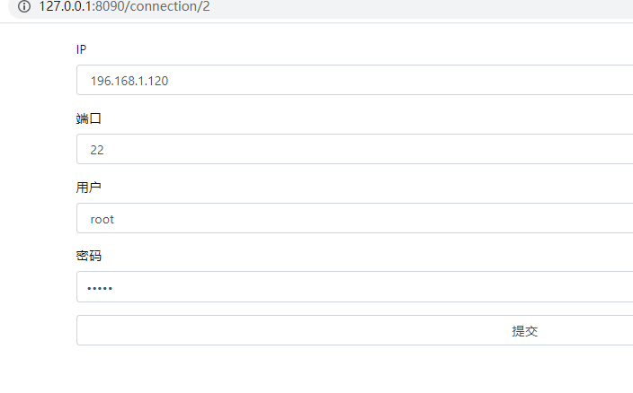
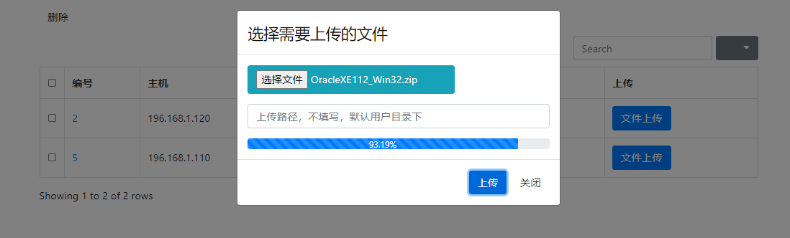

## webssh_caesarlinsa

### 注册连接
web进入默认在注册ssh连接页面    

### 连接列表
在/connection/list url展示所有连接    

### 修改连接
在/connection/list url 连接列表页面，点击编号 
    

### 登录服务器
在连接列表上，点击相应**连接**按钮，自动打开新页面，连接服务器
"/connection/ip地址/随机worker数"    

### 上传大文件(默认5G限制)
在连接列表上，点击相应**文件上传**按钮，选择文件，上传文件    
**TODO** 上传进度显示    

